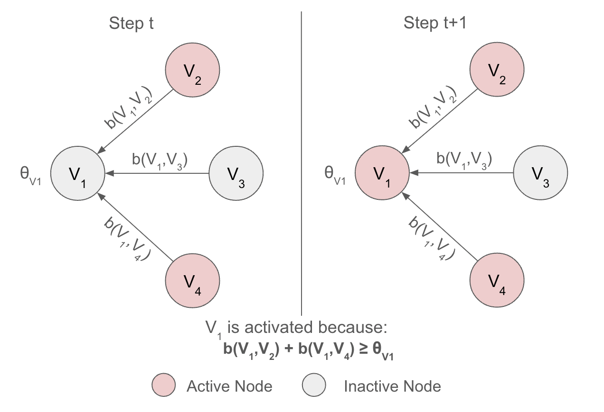
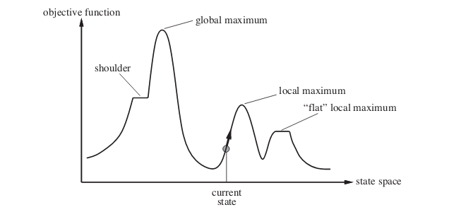

```{r setup, include=FALSE}
knitr::opts_chunk$set(echo = FALSE)
```

# Setting Up

Linear Threshold Model (LTM) is one of the famous models simulating the spread of influence in networks. Continuing with the movie-inspired analogy, let's delve into the mechanics of how influence spreads through a network, denoted as $G$. In this directed network, each individual is represented as a node, categorized as either ***active*** (an adopter of the idea) or ***inactive***. Drawing from our motivation, the general assumption is that each node tends to become active.

Now, let's consider the process in which nodes transition from being inactive to active. This transition occurs monotonically, meaning nodes can only shift from being inactive to active, but not the other way around. Thus, as time progresses, more and more of a node $v$'s neighbors become active. At some point, a neighbor node $w$ influences $v$ to become active, triggering further decisions among other nodes connected to $v$.


# Linear Threshold Model (LTM) 

```{r, echo=FALSE, fig.cap="Linear Threshold Model example", out.width = '80%', fig.align = 'center'}

```

In the Linear Threshold model, a node $v$ is influenced by each neighbor $w$ with a weight $b_{v,w}$ such that 
$$\sum_{w \text{ neighbor of v}} b_{v,w} \le 1$$
. Each node $v$ has a threshold $\theta_v$ which is randomly drawn from the uniform distribution over the interval $[0,1]$, representing the different levels of tendency for each node to adopt the idea from their neighbors. 

With a given a random threshold and an initial set of active nodes $A_0$ (while all other nodes are inactive), the model operates in discrete steps. In step $t$, all nodes that are active in step $t-1$ remain active, and any inactive node $v$ in step $t-1$ becomes active if the weighted sum of its active neighbors is at least $\theta_v$:
$$\sum_{w\text{ active neighbors of v}} b_{v,w}\ge \theta_v$$


# Influence Maximization Problem

The Influence Maximization Problem focuses on finding the best starting nodes to kick off the spread of influence in a network. It's all about figuring out: Where should we begin to maximize the nodes' impact?

To crack this problem, we define the ***influence*** of a set of nodes $A$, denoted as $\sigma(A)$, as the expected number of active nodes at the end of the process, assuming $A$ is our initial set of active nodes $A_0$. So, the goal of the influence maximization problem is to identify the best initial set of nodes $A_0$, given a certain number $k$ where $k\in \bf{N}$, to maximize our influence.


### Why is it important?

This problem is important because it helps us understand how information or behavior spreads in networks. By finding the most influential starting points, we can set off a chain reaction that gets more and more people on board with our idea or action. This matters a lot in areas like marketing, where we want to reach as many customers as possible, in disease control, where we aim to stop outbreaks before they spread, and in understanding social networks, where we want to see how trends catch on among groups of people.


### Apporximation for Influence Maximization

However, it turns out that the influence maximization problem is acutally **NP-hard**, meaning that it could not be solved in polynomial time (assuming $P\neq NP$). Thus, solving it efficiently isn't straightforward--it's a really complex problem that could take a long time to solve, especially as the size of the network is huge (Processing 30,000 nodes will take days to complete). 

Therefore, the best approach will be approximating the influence maximization problem. Here are several approximation guarantees to ensure that the following approximation method works. 

- For an arbitrary instance of Linear Threshold Model, the resulting influence function $\sigma(\cdot)$ is **submodular**. 

  - $\sigma(\cdot)$ is *submodular* if it exhibits the "diminishing marginal returns", meaning that the marginal gain from adding a element to a set $S$ is at least as high as the marginal gain from adding the same element to $T$ where $S\subseteq T$. Mathematically, this is represented as: $f(S\cup \{v\})-f(S) \ge f(T\cup \{v\})-f(T), \forall$ elements $v$ and all pairs of sets $S\subseteq T$. 
  
  - Submodularity is important because it guarantees that the greedy algorithm's approximation will not overshoot the optimal solution too much. Specifically, it ensures that the marginal gain achieved by adding a node to the seed set diminishes as the size of the seed set increases. This property allows the greedy algorithm to make locally optimal decisions at each step.

  - This also implies that $\sigma(\cdot)$ is also a *monotone* function. This means that adding an element to the set cannot make the overall influence decrease, which aligns with the intuitive expectation that more influencers lead to more influence. 


### Algorithm: Greedy Hill-Climbing

One proposed approximation strategy is to use the greedy hill-climbing. 

Greedy hill-climbing is an iterative algorithm that begins with an arbitrary solution to a problem and then tries to enhance it by making small incremental adjustments. If a change results in a better solution, the algorithm adopts it and continues making further adjustments until no further improvements can be made.

In the context of the influence maximization problem, we employ greedy hill-climbing to identify the most influential nodes. We begin with an empty active set $A_0$. At each step $i$, the algorithm selects one node to activate, aiming to maximize its influence on the network. However, it's important to note that this approach may only lead to finding local maximum seed nodes, rather than a globally optimal solution. 

This approach achieves an approximation ratio of 63% but performs fairly slow and not salable. 

```{r, echo=FALSE, fig.cap="Hill Climbing Algorithm. Created by Mahyavanshi, B.", out.width = '80%', fig.align = 'center'}

```


## References {.appendix}
- Chen, W., Yuan, Y., & Zhang, L. (2010). Scalable Influence Maximization in Social Networks under the Linear Threshold Model. 2010 IEEE International Conference on Data Mining, 88-97.

- Kempe, D., Kleinberg, J.M., & Tardos, É. (2003). Maximizing the spread of influence through a social network. Theory Comput., 11, 105-147.

- Mahyavanshi, B. (2019, September 8). Introduction to hill climbing: Artificial intelligence. Medium. https://medium.com/@bhavek.mahyavanshi50/introduction-to-hill-climbing-artificial-intelligence-a3714ed2d8d8 


