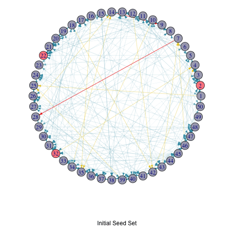

```{r setup, include=FALSE}
knitr::opts_chunk$set(
  echo = FALSE, 
  collapse = TRUE, 
  warning = FALSE,
  message = FALSE,
  fig.height = 4.75, 
  fig.width = 6.25,
  fig.align = 'center')
```


```{r}
library(tidyverse) 
library(ggpubr)
library(igraph)
library(poweRlaw)
library(ggformula)
library(data.table)
library(graphics)
library(knitr)
library(rmarkdown)
library(wesanderson) # color
library(animation)

theme_set(theme_bw())
```


# Liner Threshold Model

In this section, I've developed key functions to implement the Linear Threshold Model.

Firstly, I created two methods for assigning edge weights: uniform weights and random weights. Recall from the methodology, it's crucial that the sum of weights from neighboring nodes doesn't exceed 1, a requirement of the Linear Threshold Model (LTM):
\[
\sum_{w \text{ neighbor of } v} b_{v,w} \leq 1
\]
This ensures that the cumulative influence exerted by neighboring nodes remains within manageable bounds, facilitating robust analyses within the LTM framework.

For uniform weights (`uniformWeights`), each incoming edge to node \( v \) in graph \( G \) with degree \( \text{deg}_v \) is assigned an equal weight of \( \frac{1}{\text{deg}_v} \). With random weights (`randomWeights`), each edge receives a random weight. After assignment, weights are normalized for all incoming edges of each node to ensure their sum equals 1.

```{r, code_folding=TRUE}
# Function to calculate uniform edge weights
## Every incoming edge of v with degree dv has weight 1/dv.
uniformWeights <- function(G) {
  # Initialize empty list to store edge weights
  Ew <- list()
  # Loop over edges in the graph
  for (e in E(G)) {
    # Get the target node of the edge
    v <- ends(G, e)[2]
    # Calculate the degree of the target node
    dv <- degree(G, v, mode = "in")
    # Assign weight to the edge
    Ew[[as.character(e)]] <- 1 / dv
  }
  return(Ew)
}

# Function to calculate random edge weights 
## Every edge has random weight. After weights assigned, we normalize weights of all incoming edges for each 
# node so that they sum to 1.
randomWeights <- function(G) {
  Ew <- list()  # Initialize empty list to store edge weights
  # Assign random weights to edges
  for (v in V(G)) {
    in_edges <- incident(G, v, mode = "in")  # Get incoming edges for the current node
    ew <- runif(length(in_edges))  # Generate random weights for incoming edges
    total_weight <- sum(ew)  # Calculate the total weight of incoming edges
    # Normalize weights so that they sum to 1 for each node
    ew <- ew / total_weight
    # Store the weights for the incoming edges
    for (i in seq_along(in_edges)) {
      Ew[[as.character(in_edges[i])]] <- ew[i]
    }
  }
  return(Ew)
}
```

\
With the network, edge weight setup, and the set of initial active nodes \( A_0 \) (referred to as \( S \) in the function), we're ready to execute a linear threshold model! 

Focusing on a **single** iteration, the `runLT` function assigns a threshold to each node from a uniform distribution. It then calculates the total weight of the activated in-neighbors, updates it, and compares the total weights with the nodes' thresholds. If the total weights exceed the threshold, the node is activated. The final output is a list of total active nodes in the network.

```{r, code_folding=TRUE}
# Function to run linear threshold model
runLT <- function(G, S, Ew) {
  T <- unique(S)  # Targeted set with unique nodes
  lv <- sapply(V(G), function(u) runif(1))  # Threshold for nodes
  W <- rep(0, vcount(G))  # Weighted number of activated in-neighbors
  Sj <- unique(S)
  
  while (length(Sj) > 0) {
    if (length(T) >= vcount(G)) {
      break  # Break if the number of active nodes exceeds or equals the total number of nodes in G
    }
    Snew <- c()
    for (u in Sj) {
      neighbors <- neighbors(G, u, mode = "in")
      for (v in neighbors) {
        e <- as.character(get.edge.ids(G, c(v, u)))  # Define 'e' as the edge index
        if (!(v %in% T)) {
          # Calculate the total weight of the activated in-neighbors
          total_weight <- sum(Ew[[e]])
          
          # Update the weighted number of activated in-neighbors
          W[v] <- W[v] + total_weight
          
          # Check if the threshold is exceeded
          if (W[v] >= lv[v]) {
            Snew <- c(Snew, v)
            T <- c(T, v)
          }
        }
      }
    }
    Sj <- unique(Snew)  # Ensure unique nodes in the new set
  }
  return(T)  # Return all activated nodes
}
```

\
Now, let's extend to **multiple** iterations! 

The `activeNodes` function is the main function for calculating the total number of active nodes at each iteration. It iterates through the process and prints out the names of the active nodes for each iteration in the console. The function outputs a two-column table displaying the total number of active nodes in each iteration.

```{r, code_folding=TRUE}
# Function to calculate the total number of active nodes at each iteration
activeNodes <- function(G, S, Ew, iterations) {
  active_df <- data.frame(iteration = integer(), 
                          total_active_nodes = integer())
  total_active_nodes <- rep(0, iterations)  # Initialize empty vector to store total active nodes
  
  for (i in 1:iterations) {
    T <- runLT(G, S, Ew)
    message("--", i,"T:  ", T, "\n") # print active node names for this iteration in the console
    total_active <- length(unique(T))  # Calculate the total active nodes in this iteration
    total_active_nodes[i] <- total_active  # Update total active nodes for current iteration
    
    # Limit total active nodes to the number of nodes in the graph
    if (total_active_nodes[i] >= vcount(G)) {
      total_active_nodes[i] <- vcount(G)  
    }
    
    # Update data frame with current iteration's total active nodes
    active_df <- rbind(active_df, data.frame(iteration = i, 
                                             total_active_nodes = total_active_nodes[i]))
    
    # Update seed set S for the next iteration
    S <- unique(c(S, T))
  }
  return(active_df)
}
```

\

# Random Graph Setup 

What are some simple network? 

I employed the [Erdős–Rényi model](https://en.wikipedia.org/wiki/Erd%C5%91s%E2%80%93R%C3%A9nyi_model) \( G(n, p) \) and the [preferential attachment model](https://en.wikipedia.org/wiki/Preferential_attachment). These models offer a straightforward way to simulate network structures, allowing for comparisons between random graphs and those with power law distributions. 

### Erdős-Rényi model
Here's an example of the Erdős-Rényi model with 50 nodes. Each edge has a 5% probability of being included. Using uniform edge weights, the edges vary in width and color: thinner and blue for smaller weights, and wider and red for larger weights.

```{r, code_folding=TRUE, fig.height=4, fig.width=4}
## Erdős–Rényi model
set.seed(123)
# Create a random graph with 50 nodes and edge weights satisfying the constraint
random_graph_50 <- erdos.renyi.game(50, p = 0.05, directed = TRUE) # random graph set up

# Equal edge weight for node v -> Calculate uniform edge weights
Ew_uniform <- uniformWeights(random_graph_50)

# Scale edge width based on the weights in Ew_uniform
edge_width <- sapply(E(random_graph_50), function(e) {
  v <- ends(random_graph_50, e)[2]
  Ew_uniform[[as.character(e)]]
})

# Map edge_width to color_palette
color_palette <- wes_palette(n=5, name="Zissou1")
edge_color <- color_palette[cut(edge_width, breaks = 5)]

# Plot the graph with gradient edge color
par(mar=c(0,0,0,0)+.1)
p1 <- plot.igraph(random_graph_50, 
            edge.width = edge_width, 
            edge.color = edge_color,
            edge.arrow.size = 0.4,
            layout = layout.circle,
            vertex.label = NA,
            vertex.size = 10, 
            vertex.color =  "#A9AABC")
```

### Preferential attachment model
Here's an example of the Preferential attachment model with 50 nodes. The graph follows a power-law distribution with power equal to $1$. Each node connects to the existing nodes with a fixed number $m$ of links. Similarly, using uniform edge weights, the edges vary in width and color: thinner and blue for smaller weights, and wider and red for larger weights.

> **What is power law?** In network science, it describes the distribution of node degrees, where a few nodes have many connections while most nodes have few connections.


```{r, code_folding=TRUE, fig.height=4, fig.width=4}
## Preferential attachment model
set.seed(123)
# Create a random graph with 50 nodes and edge weights satisfying the constraint
random_graph_50 <- sample_pa(50, power = 1, m = 5) # random graph set up

# Equal edge weight for node v -> Calculate uniform edge weights
Ew_uniform <- uniformWeights(random_graph_50)

# Scale edge width based on the weights in Ew_uniform
edge_width <- sapply(E(random_graph_50), function(e) {
  v <- ends(random_graph_50, e)[2]
  Ew_uniform[[as.character(e)]]
})

# Map edge_width to color_palette
color_palette <- wes_palette(n=5, name="Zissou1")
edge_color <- color_palette[cut(edge_width, breaks = 5)]

# Plot the graph with gradient edge color
par(mar=c(0,0,0,0)+.1)
p1 <- plot.igraph(random_graph_50, 
            edge.width = edge_width, 
            edge.color = edge_color,
            edge.arrow.size = 0.4,
            layout = layout.circle,
            vertex.label = NA,
            vertex.size = 10, 
            vertex.color =  "#A9AABC")
```

\

## Example Usage for LTM

Experiment with various simulation setup! The plot and table depict the total active nodes for each iteration in five random graphs labeled as `df1` to `df5`. 
If the plot displays a horizontal line, it suggests no increase in active nodes, which can occur. Attempt running the simulation multiple times to observe changes. 

<iframe src="https://wx-zhu.shinyapps.io/LTM_simulation/" class="l-page shaded" height="1000px"></iframe>


# Greedy Algorithm for LTM 

I've developed two functions to implement the hill climbing algorithm on LTM. 

The `avgLT` function calculates the average size of activated nodes in the current step. On the other hand, the `Greedy_LTM` function is the primary tool for the greedy hill climbing approach. It requires input parameters including the graph, edge weights, the initial seed set size (denoted as $k$), and the number of iterations. For instance, if the number of iterations is 10, it selects the node with the maximum influence in the current iteration and adds it to the seed set. The output is $k$ initial active nodes that maximize the local influence.

```{r, code_folding=TRUE}
# Function to calculate average size of activated nodes
avgLT <- function(G, S, Ew, iterations = 1) {
  avgSize <- 0
  for (i in 1:iterations) {
    T <- runLT(G, S, Ew)
    avgSize <- avgSize + length(T) / iterations
  }
  return(avgSize)
}


# Greedy_LTM function to select k initial active nodes that maximize the local influence
Greedy_LTM <- function(G, Ew, k, iterations) {
  start <- Sys.time()  # Record the start time
  S <- c()  # Initialize the seed set
  
  for (i in 1:k) {
    inf <- data.frame(nodes = V(G), influence = NA)  # Initialize the influence table
    
    # Calculate the influence for nodes not in S
    for (v in V(G)) {
      if (!(v %in% S)) {
        inf$influence[v] <- avgLT(G, c(S, v), Ew, iterations = 1)
      }
    }
    
    # Exclude nodes already in S
    inf_excluded <- inf[!inf$nodes %in% S, ]
    
    # Select the node with maximum influence and add it to the seed set
    u <- inf_excluded[which.max(inf_excluded$influence), ]$nodes
    cat("Selected node:", u, "with influence:", max(inf_excluded$influence), "\n")
  
    # Convert node name to numeric
    u <- as.numeric(u)
    
    # Add selected node to the seed set
    S <- c(S, u)
  }
  
  end <- Sys.time()  # Record the end time
  # Print the total time taken
  print(paste("Total time:", end - start))
  
  return(S)  # Return the seed set
}
```


## Example: Greedy Algorithm of Influence Max Problem on LTM

### Animation

To illustrate the iterative process of the greedy algorithm, I've added a brief animation depicting how the active nodes increase based on the initial seed set. I modified the `activeNodes` function to `activeNodes_list`, which stores the names of active nodes in each iteration in a list.

Using this approach, I applied the hill-climbing algorithm to the Erdős–Rényi model with 50 nodes and uniform edge weights to select 3 initial active nodes. The animation showcases the activation process over 5 iterations.

```{r code_folding=TRUE}
# Adapt function to store the total number of active nodes at each iteration in list
activeNodes_list <- function(G, S, Ew, iterations) {
  active_df <- data.frame(iteration = integer(), 
                          total_active_nodes = integer())
  total_active_nodes <- rep(0, iterations)  # Initialize empty vector to store total active nodes
  T_list <- list()  # Initialize list to store T values
  
  for (i in 1:iterations) {
    T <- runLT(G, S, Ew)
    # cat("--", i,"T:  ", T, "\n")
    total_active <- length(unique(T))  # Calculate the total active nodes in this iteration
    total_active_nodes[i] <- total_active  # Update total active nodes for current iteration
    
    # Limit total active nodes to the number of nodes in the graph
    if (total_active_nodes[i] >= vcount(G)) {
      total_active_nodes[i] <- vcount(G)  
    }
    
    # Update data frame with current iteration's total active nodes
    active_df <- rbind(active_df, data.frame(iteration = i, 
                                             total_active_nodes = total_active_nodes[i]))
    
    # Store T values in the list
    T_list[[i]] <- T
    
    # Update seed set S for the next iteration
    S <- unique(c(S, T))
  }
  
  return(list(active_df = active_df, T_list = T_list))
}


# Example usage
random_graph <- erdos.renyi.game(50, 0.1, directed = TRUE)
# Calculate uniform edge weights
Ew_uniform <- uniformWeights(random_graph)

# Run the Greedy_LTM function
seed_set <- Greedy_LTM(random_graph, Ew_uniform, k = 3, iterations = 5)
```

```{r code_folding=TRUE}
active_df_selectedSeed <- activeNodes_list(random_graph, seed_set, Ew_uniform, iterations = 5)

# Scale edge width based on the weights in Ew_uniform
edge_width <- sapply(E(random_graph), function(e) {
  v <- ends(random_graph, e)[2]
  Ew_uniform[[as.character(e)]]
})
# Map edge_width to color_palette
color_palette <- wes_palette(n = 5, name = "Zissou1")
edge_color <- color_palette[cut(edge_width, breaks = 5)]


# Add seed set to the beginning of T_list
T_list_with_seed <- c(list(seed_set), active_df_selectedSeed[["T_list"]])

# Create the GIF
saveGIF(
  expr = {
    for (i in seq_along(T_list_with_seed)) {
      T <- T_list_with_seed[[i]]
      par(mar=c(6,0,0,0)+.1)
      p <- plot.igraph(
        random_graph,
        edge.width = edge_width,
        edge.color = edge_color,
        edge.arrow.size = 0.4,
        layout = layout.circle,
        # vertex.label = NA,
        vertex.size = 10,
        vertex.color = ifelse(1:vcount(random_graph) %in% T, "#FC888F", "#A9AABC")
      )
      title(p, ifelse(i == 1, "Initial Seed Set", paste("In Step", i - 1)))
    }
  },
  movie.name = "LTM_animation_greedy.gif",
  clean = TRUE,
  fps = 4,  # Adjust fps value as needed
  fig.height = 4,  # Adjust figure height
  fig.width = 6  # Adjust figure width
)

# include animation

```


### Simulation

The plot and table show the total active nodes for each iteration in three randomly generated graphs labeled as `df1` to `df3`, and one graph with initially selected active nodes denoted as `greedy`.  If the plot displays a horizontal line, it suggests no increase in active nodes, which can occur. Attempt running the simulation multiple times to observe changes. 

Please be patient as the algorithm may take a few minutes to run for complicated setup.

<iframe src="https://wx-zhu.shinyapps.io/LTM_greedy/" class="l-page shaded" height="1000px"></iframe>


## References {.appendix}
- ERDdS, P., & R&wi, A. (1959). On random graphs I. Publ. math. debrecen, 6(290-297), 18.

- Barabási, A. L., & Albert, R. (1999). Emergence of scaling in random networks. science, 286(5439), 509-512.


