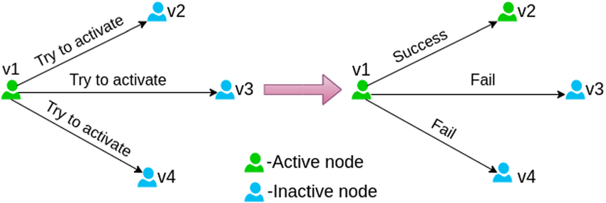

```{r setup, include=FALSE}
knitr::opts_chunk$set(echo = FALSE)
```

# Influence maximization algorithm: LDAG

Another interesting influence maximization algorithm is LDAG algorithm. Due to the not-scalable and slow limitation of the hill-climbing algorithm, Chen Et al. invented a new algorithm that relies on the linear relationship in activation probabilities between a node and its in-neighbors in directed acyclic graphs (DAGs). 

The algorithm involves creating a local DAG around each node in the network. This limits influence within the local DAG, making influence calculations quicker. Then, they used a greedy algorithm to choose local DAGs that capture a substantial influence spread. This LDAG algorithm gradually adds nodes to the local DAG of a given node $v$, ensuring their individual influence exceeds the threshold $\theta_v$. Once the local DAGs are built, they integrate the greedy method again for selecting seeds that maximize incremental influence spread with a swift scheme for updating the spread of every node.

On the positive side, The LDAG algorithm offers faster influence computations within smaller local DAG structures, which improves tractability and speed, especially in large networks. However, the limited scope of local DAGs may not fully capture the network's intricate influence dynamics. This can result in suboptimal seed selection and reduced influence spread compared to the comprehensive approach of the greedy hill-climbing algorithm.

> Chen, W., Yuan, Y., & Zhang, L. (2010). Scalable Influence Maximization in Social Networks under the Linear Threshold Model. 2010 IEEE International Conference on Data Mining, 88-97.


# Other information diffusion models

### Independent cascade model

Another famous information diffusion model is independent cascade model (ICM). 

The ICM and the LTM both operate on *discrete* steps for information propagation within social networks and both use *binary* representation of opinions, where individuals either adopt the information or remain uninformed.

However, they differ in their mechanisms of influence spread. In ICM, information spreads through a network in discrete steps or cascades. At each step, an individual who adopts the information can **independently** influence their neighbors with a certain probability. Conversely, LTM relies on a deterministic threshold mechanism, where nodes adopt or reject opinions based on predefined thresholds. 

> Kempe, D., Kleinberg, J.M., & Tardos, É. (2003). Maximizing the spread of influence through a social network. Theory Comput., 11, 105-147.

```{r, echo=FALSE, fig.cap="IC model. Created by Kalyanee Devi.", out.width = '90%', fig.align = 'center'}

```

### DeGroot learning model

The DeGroot learning model presents an alternative approach to understanding information diffusion in social networks compared to the Linear Threshold Model (LTM). 

Unlike LTM, which focuses on individual nodes adopting opinions based on a threshold of influenced neighbors, the DeGroot model emphasizes **consensus formation** through iterative averaging of opinions among network neighbors. In this model, each node's opinion is updated by averaging its own opinion with those of its connected neighbors, weighted by the strength of their connections via a one-to-one trust matrix $T$ where $T_{ij}$ is the weight that person $i$ puts on person $j$'s opinion. This iterative process updates by $$p(t) = T\cdot p(t-1)$$
until convergence, differing from LTM by emphasizing consensus rather than threshold-based adoption.

Moreover, the DeGroot learning model uses **continuous** opinion values from 0 to 1, indicating the degree of agreement. In contrast, LTM relies on **binary** opinions: individuals adopt neighbor opinions if they exceed a threshold, otherwise maintaining their own. This distinction affects how opinions spread and consensus forms in social networks.

> DeGroot, M. H. (1974). Reaching a Consensus. Journal of the American Statistical Association, 69(345), 118–121. https://doi.org/10.2307/2285509


