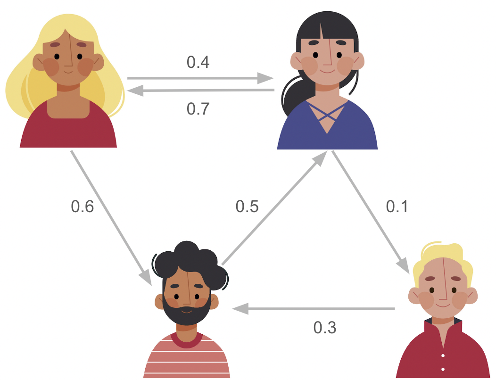

```{r setup, include=FALSE}
knitr::opts_chunk$set(echo = FALSE)

# Learn more about creating websites with Distill at:
# https://rstudio.github.io/distill/website.html
```

# Intro to Graphs

Graphs (networks) are visual representations of connections between things. They consist of dots (nodes) connected by lines (edges). Graphs help us understand how things are related and how information flows in systems like social networks, transportation routes, and more.


# Spread of Influence

Imagine you're planning a movie night with your friends. You suggest watching a new superhero movie, but not everyone is immediately on board. However, you know that once a few friends agree to watch it, they'll start convincing others to join in.

In this scenario, your social circle forms a network where each person's decision to watch the movie is influenced by their connections. When one friend agrees to watch, they start spreading the excitement to other connected peers in the network. Soon enough, more and more friends agree with the superhero movie bandwagon.

This simple example illustrates how influence can spread through a network, starting with just a few initial adopters and gradually reaching a larger portion of the group as the excitement/agreement spreads from friend to friend.

```{r, echo=FALSE, fig.cap="Influence Spread Example", out.width = '67%', fig.align = 'center'}

```

# What will be covered? 

In this website, we will delve into the foundational concepts of the Linear Threshold Model (LTM), exploring its implications in understanding information diffusion and solving the influence maximization problem. We'll provide insights into the methodology of LTM, its practical applications, and explore the hill-climbing algorithm—an indispensable tool for optimizing influence in networks.


## Acknowledgement{.appendix}

A huge thank you to my professor [Andrew Beveridge](https://mathbeveridge.github.io/) for delivering this amazing Network Science capstone class. Your expertise and passion have truly enriched our learning experience. :) 


